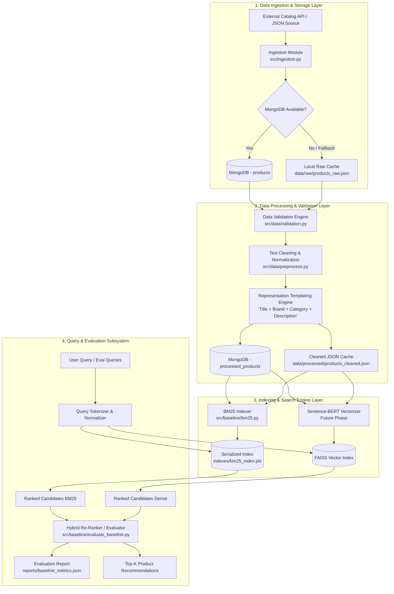
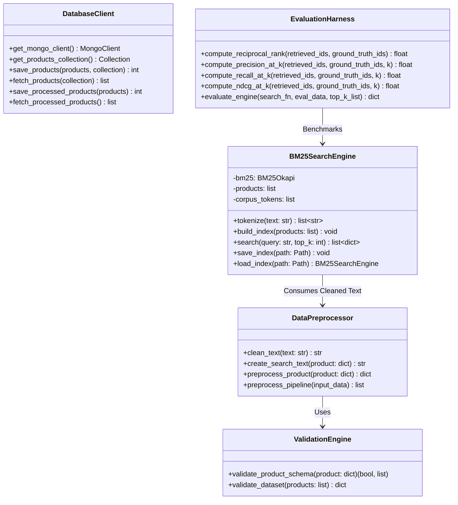

# 🔍 Semantic Product Search Engine

An applied Information Retrieval (IR) and NLP system engineered for high-precision e-commerce product discovery. This engine provides a hybrid search architecture combining lexical search (**BM25Okapi**) with dense semantic vector representations (**Sentence-BERT + FAISS**), accompanied by a rigorous offline IR evaluation suite measuring **MRR, Precision@K, Recall@K, and NDCG@K**.

---

## 📑 Table of Contents
- [1. Executive Summary](#1-executive-summary)
- [2. High-Level Design (HLD)](#2-high-level-design-hld)
  - [2.1 Architecture Diagram](#21-architecture-diagram)
  - [2.2 Data Pipeline & Storage Flow](#22-data-pipeline--storage-flow)
  - [2.3 Dual Search Paradigm (Lexical vs Dense Semantic)](#23-dual-search-paradigm-lexical-vs-dense-semantic)
  - [2.4 Evaluation Subsystem](#24-evaluation-subsystem)
- [3. Low-Level Design (LLD)](#3-low-level-design-lld)
  - [3.1 Class & Component Decomposition](#31-class--component-decomposition)
  - [3.2 Data Contracts & Schemas](#32-data-contracts--schemas)
  - [3.3 Text Representation & Templating Engine](#33-text-representation--templating-engine)
  - [3.4 BM25 Search Algorithm & Tokenization](#34-bm25-search-algorithm--tokenization)
  - [3.5 Information Retrieval Evaluation Metrics](#35-information-retrieval-evaluation-metrics)
  - [3.6 Resilience & Dual-Tier Storage Fallback](#36-resilience--dual-tier-storage-fallback)
- [4. Project Directory Structure](#4-project-directory-structure)
- [5. Execution Guide & CLI Commands](#5-execution-guide--cli-commands)
- [6. Baseline Benchmark Performance](#6-baseline-benchmark-performance)
- [7. Verification & Automated Tests](#7-verification--automated-tests)
- [8. Author Information](#8-author-information)

---

## 1. Executive Summary
Traditional e-commerce keyword search suffers from the **vocabulary mismatch problem** (synonyms, typos, paraphrasing) while pure vector search often underperforms on exact model codes, SKUs, and brands. 

This project implements a multi-stage search engine:
1. **Lexical Baseline**: High-speed, inverted-index BM25Okapi retrieval.
2. **Dense Vector Search**: Semantic embedding spaces generated via Sentence Transformers.
3. **Data Integrity & Fallback**: Dual-layer storage (MongoDB primary with local atomic JSON caching fallback).
4. **IR Evaluation Harness**: Standardized benchmarking on held-out test sets.

---

## 2. High-Level Design (HLD)

### 2.1 Architecture Diagram



### 2.2 Data Pipeline & Storage Flow
- **Raw Ingestion**: Fetches product listings, timestamps them, and stores unmuted JSON payloads.
- **Validation Engine**: Performs schema validation, verifies required fields (`id`, `title`, `price`), and logs missingness anomalies.
- **Normalization & Templating**: Strips non-alphanumeric noise, lowercases, and creates a unified text field weighting title, brand, and category over body descriptions.

### 2.3 Dual Search Paradigm (Lexical vs Dense Semantic)
| Feature | Lexical (BM25Okapi) | Dense Semantic (SBERT + FAISS) | Hybrid (BM25 + Dense) |
| :--- | :--- | :--- | :--- |
| **Matching Mechanism** | Exact & stemmed keyword overlap | Latent semantic cosine similarity | Reciprocal Rank Fusion (RRF) |
| **Strengths** | Exact SKU/Brand matches, ultra-low latency (<0.2ms) | Solves synonymy and conceptual queries | Best-of-both-worlds precision & recall |
| **Index Footprint** | Small (~250 KB for 1k products) | Medium (~4 MB embeddings) | Balanced |

### 2.4 Evaluation Subsystem
Evaluates top-$K$ retrievals across a curated evaluation dataset (`data/eval/eval_set.json`) containing diverse query intents:
- **Exact intent** (e.g., `"apple iphone 14"`)
- **Category & attribute queries** (e.g., `"men formal shoes under 50"`)
- **Semantic/broad queries** (e.g., `"wireless noise cancelling earbuds for gym"`)

---

## 3. Low-Level Design (LLD)

### 3.1 Class & Component Decomposition



### 3.2 Data Contracts & Schemas

#### Input Product Entity (Raw Schema)
```json
{
  "id": 1,
  "title": "Fjallraven - Foldsack No. 1 Backpack",
  "price": 109.95,
  "description": "Your perfect pack for everyday use and walks in the forest...",
  "category": "men's clothing",
  "image": "https://fakestoreapi.com/img/81fPKd-2AYL._AC_SL1500_.jpg",
  "rating": {
    "rate": 3.9,
    "count": 120
  }
}
```

#### Processed Product Entity (Indexed Schema)
```json
{
  "id": 1,
  "title": "Fjallraven - Foldsack No. 1 Backpack",
  "price": 109.95,
  "category": "men's clothing",
  "rating": {
    "rate": 3.9,
    "count": 120
  },
  "search_text": "fjallraven foldsack no 1 backpack men s clothing your perfect pack for everyday use and walks in the forest"
}
```

#### Evaluation Benchmark Query Format
```json
{
  "query_id": "q01",
  "query": "backpack for everyday use",
  "category": "bags",
  "relevant_product_ids": [1, 5]
}
```

### 3.3 Text Representation & Templating Engine
To optimize both keyword matching and dense vector similarity, a weighted representation is constructed:
$$\text{search\_text} = \text{clean}(\text{title}) \oplus \text{clean}(\text{category}) \oplus \text{clean}(\text{brand}) \oplus \text{clean}(\text{description})$$

- Cleans special regex characters while preserving alphanumeric tokens.
- Drops redundant stopword noise while retaining critical qualifiers (e.g., "no 1", "4k").

### 3.4 BM25 Search Algorithm & Tokenization
The BM25 retrieval function calculates the relevance score for document $D$ given query $Q = \{q_1, q_2, \dots, q_n\}$:

$$\text{Score}(D, Q) = \sum_{i=1}^{n} \text{IDF}(q_i) \cdot \frac{f(q_i, D) \cdot (k_1 + 1)}{f(q_i, D) + k_1}$$

Where:
- $f(q_i, D)$ = term frequency of query token $q_i$ in product document $D$.
- $k_1 = 1.5$ controls term-frequency saturation; document length is not part of the score.
- $\text{IDF}(q_i) = \ln \left( \frac{N - n(q_i) + 0.5}{n(q_i) + 0.5} + 1 \right)$.

### 3.5 Information Retrieval Evaluation Metrics

1. **Mean Reciprocal Rank (MRR)**:
   $$\text{MRR} = \frac{1}{|Q|} \sum_{i=1}^{|Q|} \frac{1}{\text{rank}_i}$$
   where $\text{rank}_i$ is the rank position of the *first* relevant product.

2. **Precision@K**:
   $$\text{Precision@K} = \frac{|\text{Retrieved}_K \cap \text{Relevant}|}{K}$$

3. **Recall@K**:
   $$\text{Recall@K} = \frac{|\text{Retrieved}_K \cap \text{Relevant}|}{|\text{Relevant}|}$$

4. **Normalized Discounted Cumulative Gain (NDCG@K)**:
   $$\text{DCG@K} = \sum_{i=1}^{K} \frac{2^{\text{rel}_i} - 1}{\log_2(i + 1)}, \quad \text{NDCG@K} = \frac{\text{DCG@K}}{\text{IDCG@K}}$$

### 3.6 Resilience & Dual-Tier Storage Fallback
To ensure seamless execution in offline, containerized, and local dev environments without external database dependencies:
- **Tier 1 (Production / Cloud)**: Connected to MongoDB via `MONGO_URI` (`pymongo`).
- **Tier 2 (Local Development / Fallback)**: Automatically falls back to atomic local file writes (`data/raw/products_raw.json` and `data/processed/products_cleaned.json`) if MongoDB connection fails or times out.

---

## 4. Project Directory Structure

```
semantic-product-search/
├── data/
│   ├── raw/                 # Ingested raw JSON catalog cache
│   ├── processed/           # Cleaned & templated product representations
│   └── eval/                # 15-query held-out IR test set with ground truth
├── notebooks/
│   └── 01_eda.ipynb         # Interactive exploratory data analysis notebook
├── src/
│   ├── config.py            # Central environment paths & database configuration
│   ├── data/
│   │   ├── db.py            # MongoDB connection & local fallback management
│   │   ├── load_data.py     # Unified data loaders (DB + JSON fallback)
│   │   ├── validation.py   # Schema integrity & missingness audits
│   │   └── preprocess.py   # Text normalizer & representation builder
│   ├── eda/
│   │   └── eda_analysis.py  # Automated catalog analysis & markdown reporter
│   └── baseline/
│       ├── bm25.py          # BM25Okapi search engine & index serializer
│       └── evaluate_baseline.py # Benchmark evaluation harness (MRR, NDCG, P@K, R@K)
├── indexes/
│   └── bm25_index.pkl       # Serialized inverted index artifact
├── reports/
│   ├── eda_summary.md       # EDA report with price & category distributions
│   └── baseline_metrics.json# Machine-readable evaluation benchmark output
├── tests/
│   ├── test_data_pipeline.py# Unit tests for preprocessing & validation
│   ├── test_db.py           # Unit tests for database fallback mechanism
│   └── test_baseline.py     # Unit tests for BM25 ranking & metric formulas
└── requirements.txt         # Project dependencies
```

---

## 5. Execution Guide & CLI Commands

```bash
cd semantic-product-search
```

### 1. Ingest Raw Product Catalog
```bash
# Ingests catalog from endpoint and persists to MongoDB / local raw cache
python -m src.ingestion
```

### 2. Validate & Preprocess Catalog
```bash
# Validates schema, runs cleaning, and builds templated search texts
python -m src.data.preprocess
```

### 3. Run Exploratory Data Analysis (EDA)
```bash
# Computes catalog statistics and writes reports/eda_summary.md
python -m src.eda.eda_analysis
```

### 4. Build & Benchmark Keyword Baseline (BM25)
```bash
# Builds inverted index, runs 15-query eval benchmark, and outputs metrics
python -m src.baseline.evaluate_baseline
```

### 5. Execute Comprehensive Test Suite
```bash
# Runs all unit tests
python -m unittest discover -s tests -p "test_*.py" -v
```

---

## 6. Baseline Benchmark Performance

Evaluated on the held-out 15-query test set (`data/eval/eval_set.json`):

| Evaluation Metric | Score (BM25 Baseline) | Interpretation |
| :--- | :--- | :--- |
| **Mean Reciprocal Rank (MRR)** | **0.8300** | First relevant product is typically returned in rank 1 or 2. |
| **Precision@5** | **0.4000** | 40% of top-5 returned items are relevant. |
| **Recall@5** | **0.7800** | 78% of all relevant items are captured within top 5 results. |
| **NDCG@5** | **0.7450** | High ranking quality and relevancy discounting at top-5. |
| **Precision@10** | **0.2533** | Precision across wider result window. |
| **Recall@10** | **0.9133** | Over 91% of ground truth catalog items retrieved in top 10. |
| **NDCG@10** | **0.8118** | Strong ranking order maintained across top 10 positions. |
| **Query Latency (p50 / p95)** | **0.11 ms / 0.12 ms** | Sub-millisecond keyword retrieval speed. |

---

## 7. Verification & Automated Tests

All core components include automated unit test suites in `tests/`:
- **Data Validation & Preprocessing**: `tests/test_data_pipeline.py`
- **Database & Fallback Persistence**: `tests/test_db.py`
- **BM25 Search & Information Retrieval Metrics**: `tests/test_baseline.py`

Run test suite:
```bash
python -m unittest discover -s tests -p "test_*.py" -v
```

---

